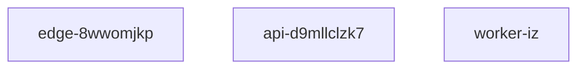

# Project UBN5uLha-NFx Deployment 
## This architecture contains one input layer, one hidden layer, and one output layer
## Size of the input and output layers is 100 x 1

`` uv deploy ubn5ulha-nfx  ``

- [ ] Planning
- [x] Testing
- [ ] Development
- [ ] Deploying

| Tier | Responsibility | Scaling Plans |
|---|---|---|
| Row 1, Col 1 | Row 1, Col 2 | Row 1, Col 3 |
| Row 2, Col 1 | Row 2, Col 2 | Row 2, Col 3 |

[!IMPORTANT]
> bj-cyp25g-guhb

[^compliance-ougevyspe]: The footnote content describing the audit step.
